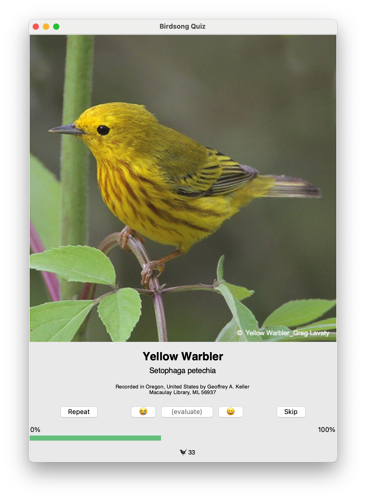

# Birdsong Quiz

This app allows you to practice identifying birds by ear using recordings from [Cornell Lab of Ornithology's Macauley Library](https://www.macaulaylibrary.org).

### important requirements

**The app requires audio files purchased from Cornell Lab of Ornithology's Macauley library.**
A set of 4,954 MP3 audio files covering the United States and Canada can be downloaded [here](https://www.macaulaylibrary.org/product/the-cornell-guide-to-bird-sounds-us-and-canada/).
In the folder with the app, create a folder named "sounds". Copy all audio files (.mp3s) that you want to use for practice to this folder.
(Note that you can copy a subset of a larger set of audio files to the folder to practice just that subset of recordings.)

### how the app works
The app creates a set of all recordings in the `/sounds` folder and plays a randomly selected recording from the set.
If you want to hear the recording again, click `Repeat`.
Once you think you know which species you are listening to, click `Reveal bird` to show a picture of the species.
Then, click `Reveal name` to reveal the species and additional information.
You evaluate your response by clicking on an emoji, and the app will track your percentage correct score.
(If you don't want to evaluate your current response, click `Skip`.)
If you indicate that your response is correct, the recording is removed from the set of recordings.
When no recordings are left, the app will repopulate the set of recordings and give you the option to reset your score.

Audio files purchased from the Macauley Library contain metadata, including a picture, common name, Latin name, place of recording, and recording artist.
The app pulls this information directly from the sound file and presents it on screen.
The app therefore only needs the soundfiles as input.
You can easily make custom quizzes (e.g. Spring migration warblers in your area) by only including a relevant subset of sound files in the `sounds/` folder.

